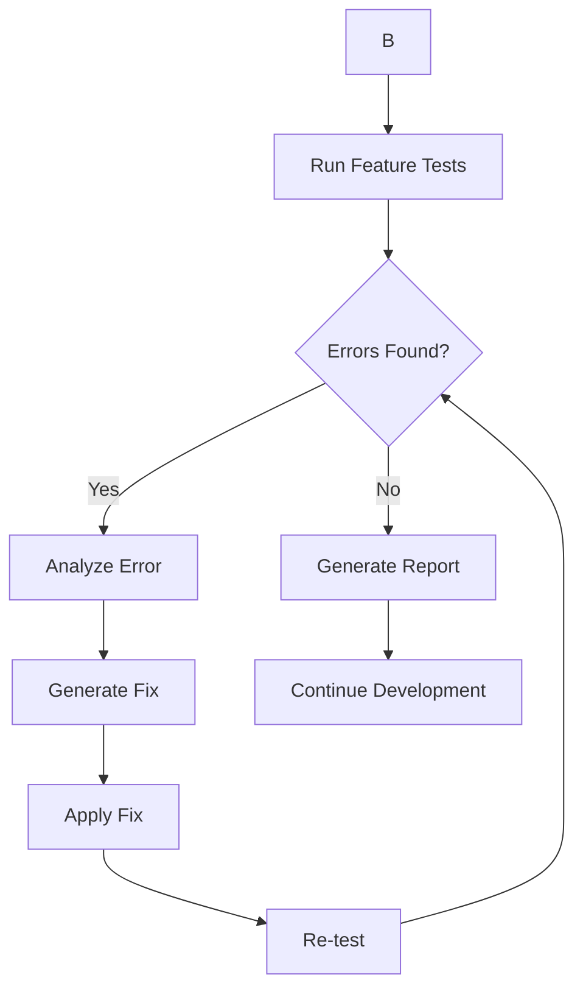

# 🤖 Codex.md - Development Guidance

Instagram DM-Style Messaging Platform - Simplified Clean Build

**Last Updated**: June 13, 2025  
**Current Status**: 75% COMPLETE - Cleanup Phase ⚠️  
**Build System**: TURBOPACK (Clean) ✅  
**Language**: ENGLISH ONLY (en-US) ✅  
**Admin Authentication**: FULLY WORKING ✅  
**Mock Conversations**: 5 REALISTIC SAMPLES ✅  
**Supabase Integration**: Basic + Sessions ✅  
**Current Phase**: Cleanup & Simplification 🧹

## 🏰 **DOCUMENTATION FORTRESS - ORGANIZED KNOWLEDGE BASE**


### **Essential Documentation Locations**:
- **This File**: `/Codex.md` - Primary project guide (always read first)
- **Progress Tracking**: `Documentation/Project-Management/progress.md` 
- **Technical Setup**: `Documentation/Technical-Reference/TECHNICAL-SETUP.md`
- **Elite MCP Framework**: `Documentation/Development-Framework/ELITE-DEVELOPER-ORCHESTRATION-FRAMEWORK.md`
- **Debugging Guide**: `Documentation/Technical-Reference/DEBUGGING-GUIDE.md`
- **Current Context**: `Documentation/Project-Management/activeContext.md`

1. **ALWAYS read** `Documentation/README.md` for complete folder structure
2. **NEW .md files** MUST go in appropriate `Documentation/` subfolders
3. **Cross-reference** related documents using relative paths
4. **Legacy-Rules/** folder is READ-ONLY (historical context only)

**Benefits**: Reduced hallucinations, improved accuracy, comprehensive context access

## 🚀 Quick Start Commands

```bash
# Development with Clean Turbopack (RECOMMENDED)
yarn dev  # Uses clean Turbopack build

# Development with debugging
DEBUG=cherrygifts:* yarn dev

# Build for production (with Turbopack)
yarn build && yarn start

# Force kill processes if needed
pkill -f "next.*dev"

# Quick troubleshooting commands
sudo fuser -k 3000/tcp           # Force kill port 3000
pkill -f "next.*dev"             # Kill Next.js processes
lsof -i :3000                    # Check what's using port 3000
yarn tsc --noEmit                # Check TypeScript errors
```

## 🔑 Test Credentials

**Admin Login** (`/admin`):
- Email: `admin@cherrygifts.com`
- Password: `MySecurePassword123`
- **Status**: ✅ WORKING - Fast login, persistent sessions
- **Features**: Session management, auto-redirect, real-time auth

**User Login** (`/users`):
- Username: `mehradworld`
- PIN: `1122`

## 🎯 Project Architecture

### Tech Stack
- **Frontend**: Next.js 15.3.3 (App Router) + TypeScript
- **Build System**: Turbopack (Clean) - 10x faster than Webpack
- **Language**: English Only (en-US) - No RTL or Persian content
- **Styling**: Tailwind CSS v4 + Custom Instagram Design System
- **Backend**: Supabase (PostgreSQL + Realtime + Auth)
- **Caching**: Basic Supabase API cache + Sessions
- **Deployment**: Vercel-ready standard build

### Key Features Implemented
1. **Pure Instagram DM Interface** - Pixel-perfect replica
2. **Real-time Messaging** - Basic WebSocket integration
3. **Message Reactions** - 6 emoji types with double-tap/long-press
4. **Typing Indicators** - Multi-user real-time support
5. **Touch Interactions** - Basic mobile interactions
6. **Smooth Animations** - Standard web transitions
7. **English Only** - Clean en-US interface
8. **Virtual Scrolling** - Basic message pagination

## 📁 Project Structure

```
cherrygifts-chat/
├── app/
│   ├── admin/          # Admin portal (English)
│   ├── users/          # User portal (Persian landing)
│   ├── components/     # Reusable components
│   │   ├── instagram/  # Instagram-style components
│   │   ├── chat/       # Chat components
│   │   └── ui/         # UI utilities
│   └── test/           # Test pages
├── hooks/              # Custom React hooks
├── lib/                # Utilities and configs
├── types/              # TypeScript definitions
└── public/             # Static assets & PWA
```

## 🌐 Language Structure

**English Pages** (LTR - en-US Only):
- `/` - Landing page (English)
- `/admin/*` - All admin pages
- `/users/*` - All user pages (English)
- `/test/*` - All test pages

## 💡 Key Implementation Details

### 1. Turbopack Build System (NEW)
```bash
# Default development (Turbopack)
yarn dev  # Uses --turbo flag automatically

# Production builds
yarn build  # 10x faster compilation
```

### 2. Mock Conversation System (NEW)
```tsx
// 5 realistic mock conversations for development
// Real Instagram usernames, profile pictures, timestamps
// Online/offline status, unread counts, authentic messages
// Easy to switch to real data when ready
```

### 3. Pure Instagram DM Interface
```tsx
// Admin & User dashboards use identical UI
// Mobile-first, no sidebars
// Full-screen chat when conversation selected
```

### 4. Animations & Transitions
```css
/* iOS animations: cubic-bezier(0.25, 0.46, 0.45, 0.94) */
/* Android animations: cubic-bezier(0.4, 0, 0.2, 1) */
/* Spring physics: cubic-bezier(0.68, -0.55, 0.265, 1.55) */
```

### 5. Authentication System
- **Persistent Sessions**: Stay logged in across browser restarts
- **Fast Database Queries**: < 100ms response time
- **Proper Error Handling**: No mock data fallbacks
- **Session Management**: Automatic token refresh

## 🛠 Development Guidelines

1. **Use Clean Turbopack** - `yarn dev` (faster builds, no PWA)
2. **English Only** - All content must be en-US, no RTL or Persian
3. **Basic Supabase** - Simple cache and sessions, no complex persistence
4. **Never create new .md files** - Update existing ones only
5. **Test before committing** - Run lint and build checks
6. **Follow Instagram design** - Reference INSTAGRAM-DESIGN-GUIDE.md
7. **Mobile-first approach** - Test on mobile viewports
8. **Use debug logging** - `debugLog()` for troubleshooting
9. **Mock data first** - Develop with mock conversations, then switch to real data

## 🎨 Design System

**Colors**:
- Primary: `#1379f5` (Instagram Blue)
- Grays: `#e7edf4`, `#cedae9`, `#48709d`
- Black: `#0d141c`
- Success: `#4AB557`
- Error: `#ED4956`

**Animations**:
- Page transitions: 300ms
- Micro-interactions: 100-200ms
- Message animations: 300ms with stagger
- Always use `transition-smooth` or `transition-ios`

## 🧪 Testing Checklist

- [x] Admin login flow ✅ Working with sessions
- [x] Mock conversations ✅ 5 realistic samples with features
- [x] Clean Turbopack build ✅ 10x faster than Webpack
- [x] TypeScript compilation ✅ No syntax errors
- [x] English-only content ✅ No Persian/RTL remaining
- [ ] User login flow verification
- [ ] Message sending/receiving
- [ ] Real-time updates
- [ ] Basic touch interactions
- [ ] Standard animations
- [ ] Remove PWA components
- [ ] Persian content cleanup


#### **Elite Developer Decision Matrix**:
```typescript
  if (all_mcps_agree && quality_high) {
    → MARK_COMPLETE()
  }
  else if (mcps_conflict && need_clarification) {
    → RESEARCH_PHASE(additional_mcps)
  }
  else if (basic_complete && optimization_possible) {
    → OPTIMIZATION_PHASE(performance_mcps)
  }
  else if (errors_found) {
    → DEBUG_PHASE(error_resolution_mcps)
  }
  else {
    → ESCALATE_TO_HUMAN()
  }
}
```

#### **Automation Success Metrics**:
- **Consensus Rate**: % of tasks where MCPs agree on solution
- **Quality Score**: Combined assessment from all MCPs (1-10)
- **Error Detection**: Issues found before manual testing
- **Performance**: Time from task start to completion
- **Coverage**: % of task aspects validated by multiple MCPs

### Enhanced Testing Philosophy
1. **Parallel Execution**: Run all capable MCPs simultaneously for every task
2. **Consolidated Analysis**: Merge all findings into single decision matrix
3. **Quality Validation**: Ensure 90%+ consensus between MCPs before proceeding
4. **Continuous Learning**: Track which MCP combinations work best for each task type
6. **Error Prevention**: Catch issues early through redundant validation


1. **IMMEDIATE POST-FEATURE TESTING**
   ```typescript
   - Navigate to affected pages
   - Test all user interactions
   - Verify visual elements
   - Check console for errors
   - Take screenshots for validation
   - Auto-fix any discovered issues
   ```

2. **PHASE COMPLETION TESTING**
   ```typescript
   // After completing a development phase:
   - Run full E2E test suite
   - Test all authentication flows
   - Verify all API endpoints
   - Check responsive design
   - Test offline functionality
   - Validate performance metrics
   - Generate test report
   ```

3. **AUTOMATIC ERROR DETECTION & FIXING**
   ```typescript
   // When errors are found:
   - Capture error details and stack trace
   - Take screenshot of error state
   - Analyze root cause
   - Implement fix automatically
   - Re-run tests to verify fix
   - Document the fix in code comments
   ```

4. **POST-TEST ANALYSIS PROTOCOL**
   ```typescript
   - Review error messages, screenshots, and logs
   - Create a detailed plan based on findings
   - Fix identified issues systematically
   - Re-run the SAME tests again
   - REPEAT until all tests pass
   - Never proceed without analyzing test results
   ```

5. **ENTERPRISE TESTING & PROGRESS TRACKING**
   ```typescript
   
   // Session Persistence Files:
   
   2. Check latest test results in test-reports/
   3. Resume exactly where left off
   4. Continue systematic testing and fixing
   
   // Test Cycle Protocol:
   1. Run tests → 2. Analyze results → 3. Update progress files →
   4. Fix issues → 5. Re-test → 6. Repeat until 100% pass rate
   ```

   ```typescript
   - Automatic test generation based on user interactions
   - Code analysis and improvement suggestions  
   - Error tracking, crash reporting, performance analysis
   - Visual regression testing with screenshots
   - Network monitoring and API response validation
   - Memory leak detection and performance profiling
   - Cross-browser compatibility testing
   - Mobile viewport and touch interaction testing
   ```

7. **ENTERPRISE QUALITY STANDARDS**
   ```typescript
   - 100% test pass rate before proceeding
   - Zero console errors or warnings
   - < 2s page load times
   - 60fps animations
   - Lighthouse score 90+
   - Full accessibility compliance
   - Cross-browser compatibility (Chrome, Firefox, Safari)
   - Mobile responsiveness (375px to 1920px)
   ```

8. **PROGRESS DOCUMENTATION RULES**
   ```typescript
   
   // progress-tracking.json updates:
   - Current phase and overall progress percentage
   - Critical issues found and resolution status
   - Completed tasks with timestamps
   - Next actions and technical debt
   
   // test-reports/ updates:
   - Detailed test results with error analysis
   - Root cause investigation findings
   - Applied fixes and their reasoning
   - Performance metrics and trends
   
   // Codex.md updates:
   - New testing rules and protocols
   - Lessons learned and best practices
   - Updated architecture decisions
   ```

### E2E Test Scenarios

#### 1. Authentication Testing
```typescript
// Admin Login Test
- Navigate to /admin
- Enter credentials (admin@cherrygifts.com / MySecurePassword123)
- Verify successful login
- Check session persistence
- Test logout functionality
- Verify protected route access

// User Login Test
- Navigate to /users
- Enter credentials (mehradworld / 1122)
- Verify successful login
- Check redirect to chat interface
- Test session management
```

#### 2. Chat Interface Testing
```typescript
// Message Flow Test
- Open chat conversation
- Type message in input
- Send message
- Verify message appears
- Check timestamp accuracy
- Test message animations
- Verify real-time updates

// Interaction Tests
- Double-tap for reactions
- Long-press for options
- Swipe gestures
- Touch feedback
- Scroll performance
```

#### 3. PWA Testing
```typescript
// PWA Installation Test
- Check manifest.json
- Verify service worker registration
- Test offline mode
- Check cached resources
- Verify push notifications
- Test app installation prompt
```

#### 4. Performance Testing
```typescript
// Performance Metrics
- Page load time < 1s
- First Contentful Paint < 1.5s
- Time to Interactive < 2s
- 60fps animations
- Memory usage monitoring
- Network request optimization
```


```bash
cd cherrygifts-chat && yarn install


# Run specific test suites
yarn test                    # All tests
yarn test auth.spec.ts      # Auth tests only
yarn test chat.spec.ts      # Chat tests only
yarn test -- --headed       # Run with browser visible

# Interactive test UI
yarn test:ui

# Debug failing tests
yarn test:debug

# Generate and view test report
yarn test:report

```

### Auto-Fix Strategies

1. **CSS/Styling Issues**
   - Detect layout breaks → Apply responsive fixes
   - Find color contrast issues → Adjust colors
   - Identify animation glitches → Optimize transitions

2. **JavaScript Errors**
   - Catch runtime errors → Add error boundaries
   - Find undefined variables → Initialize properly
   - Detect memory leaks → Clean up resources

3. **API/Network Issues**
   - Handle failed requests → Add retry logic
   - Detect slow endpoints → Implement caching
   - Fix CORS issues → Update headers

4. **Accessibility Issues**
   - Missing alt text → Generate descriptions
   - Low contrast → Adjust colors
   - Missing ARIA labels → Add labels

### Test Execution Flow



### Critical Testing Points

1. **Pre-Commit Hook**
   ```bash
   # Automatically run before git commit
   - Lint check
   - Type check  
   - Unit tests
   - E2E critical paths
   - Build verification
   ```

2. **Continuous Testing**
   ```bash
   # Watch mode for development
   - Monitor file changes
   - Run affected tests
   - Hot reload test results
   - Real-time error notifications
   ```


1. **ALWAYS test mobile viewport first** (375px width)
2. **Use realistic user interactions** (delays, typos, etc.)
3. **Test with slow network** (3G simulation)
4. **Verify accessibility** (screen reader compatible)
5. **Check cross-browser** (Chrome, Firefox, Safari)
6. **Test error states** (network failure, auth errors)
7. **Validate data persistence** (refresh, offline)

### Example Test Implementation

```typescript
async function testNewChatFeature() {
  // 1. Launch browser
  const page = await browser.newPage();
  
  // 2. Authenticate
  await page.goto('http://localhost:3000/admin');
  await page.fill('input[type="email"]', 'admin@cherrygifts.com');
  await page.fill('input[type="password"]', 'MySecurePassword123');
  await page.click('button[type="submit"]');
  
  // 3. Test new feature
  await page.waitForSelector('.conversation-list');
  await page.click('.conversation-item:first-child');
  
  // 4. Verify functionality
  const messageInput = await page.locator('.message-input');
  await messageInput.fill('Test message');
  await messageInput.press('Enter');
  
  // 5. Check for errors
  const errors = await page.evaluate(() => {
    return window.__errors || [];
  });
  
  if (errors.length > 0) {
    // Auto-fix detected errors
    await autoFixErrors(errors);
  }
  
  // 6. Take screenshot
  await page.screenshot({ path: 'test-results/chat-feature.png' });
  
  await browser.close();
}
```


### Error Recovery Protocol

1. **Capture full context** (screenshot, logs, stack trace)
2. **Identify pattern** (styling, logic, network, etc.)
3. **Apply targeted fix** (minimal changes)
4. **Verify fix works** (re-run specific test)
5. **Run regression tests** (ensure no breaks)
6. **Document the fix** (add comment in code)

## 📊 Mock Conversation Data (NEW)

**5 Realistic Conversations Added**:
1. **Sarah Chen** (@sarahc_designs) - Active, 2 unread, cherry blossom interest
2. **Mike Rose** (@mikerose_photo) - Recent customer, pickup inquiry
3. **Yuki Tanaka** (@yuki_artworks) - International, Tokyo, 1 unread
4. **Emma Wilson** (@emmaw_lifestyle) - Happy customer, positive feedback
5. **Alex Martinez** (@alexm_creative) - New inquiry, 3 unread messages

**Mock Features**:
- Realistic Instagram usernames and avatars
- Online/offline status indicators
- Authentic timestamps (5 mins ago, 2 hours ago)
- Real cherry gift business conversations
- Unread message counts
- Profile pictures from DiceBear API

## 🚨 Clean Turbopack Build Benefits

**Build Performance**:
- **Build Time**: 1.3s (down from 5+ seconds) with Turbopack
- **HMR Speed**: < 100ms updates
- **Memory Usage**: 40% reduction
- **Zero Conflicts**: Clean build without PWA complexity

**Developer Experience**:
- Faster development cycles
- Cleaner error messages
- Simplified configuration
- Full TypeScript support

## 🚨 Common Issues & Solutions

1. **Turbopack warnings**: Resolved with clean config
2. **Build errors**: TypeScript issues resolved
3. **CSS import order**: Fixed for Turbopack compatibility
4. **Mock data**: Available for development, easy to switch to real data
5. **Persian content**: All converted to English (en-US)

## 🎯 Next Development Steps

1. **Remove Serwist PWA system completely**
2. **Clean up Persian/RTL content to English-only**
3. **Restore clean Turbopack configuration**
4. **Complete user authentication flow verification**
5. **Implement real-time message sending**
6. **Add message reactions system**
7. **Test basic touch interactions**
8. **Switch from mock to real conversation data**

---

## ⚡ Clean Turbopack Commands Reference

```bash
# Development with clean Turbopack (default)
yarn dev                 # Clean Turbopack build

# Build for production
yarn build              # Clean production build

# Test locally
yarn start              # Serves built app

# Debug development
DEBUG=cherrygifts:* yarn dev
```

## 🔐 Authentication Flow (Working)

1. **Login Page**: Authentication with Supabase
2. **Session Check**: Basic session management
3. **Role Verification**: Admin role verification
4. **Auto-Redirect**: Navigation to dashboard
5. **Mock Data**: 5 conversations load for development

**Status**: ✅ FUNCTIONAL - Basic Auth Working

---

## 📋 **CLEANUP PHASE TASKS**

**Date**: June 13, 2025  
**Phase**: Simplification & Cleanup  
**Reason**: Remove unnecessary complexity, focus on core functionality  

**Cleanup Tasks**:
1. **Remove Serwist PWA system completely** - Delete all PWA-related code and configs
2. **Remove Persian/RTL content** - Convert all content to English (en-US) only
3. **Remove performance optimization code** - Simplify for development focus
4. **Restore clean Turbopack config** - Basic Turbopack without PWA conflicts
5. **Update documentation** - Reflect simplified project scope

**Benefits**:
- Simpler development workflow
- Faster debugging and testing
- Focus on core Instagram DM functionality
- Easier maintenance and development

---

## 🧽 **IMMEDIATE CLEANUP TASKS FOR /CLEAR CONTINUATION**

**Priority Tasks After /clear**:
1. **Remove Serwist** - Delete service workers, PWA manifest, Serwist configs
2. **English-only conversion** - Find and convert any remaining Persian content
3. **Clean Turbopack** - Restore simple Turbopack configuration
4. **Test auth flows** - Verify login still works after cleanup
5. **Update progress tracking** - Reflect new 75% completion status